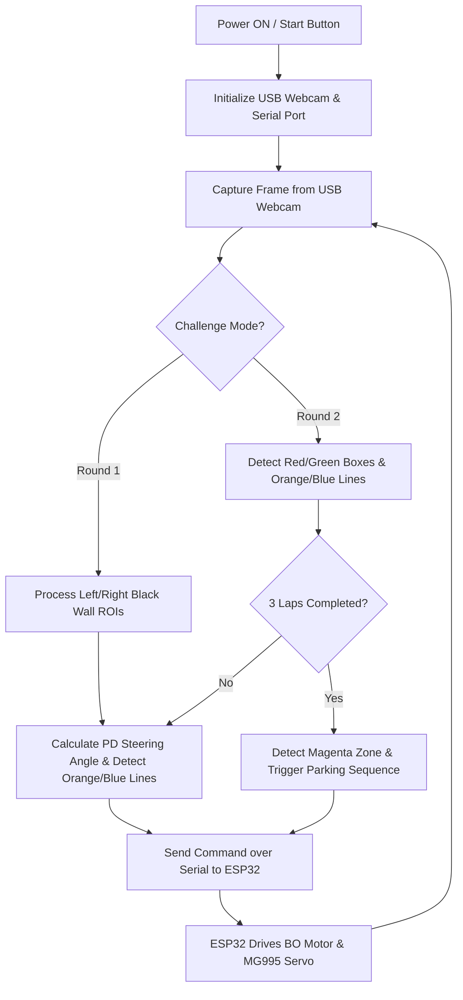

# 🤖 ROBOVANGUARD – WRO Future Engineers 2026

An intelligent autonomous vehicle engineered for the **Future Engineers** division of the **World Robot Olympiad (WRO)**. This robotic system integrates computer vision, proximity detection, and precision directional control mechanisms to autonomously execute both **Open Track (Round 1)** and **Obstacle Avoidance & Parking (Round 2)** challenges.

---

## 📁 Repository Structure

* [`t-photos/`](file:///c:/Users/mabam/OneDrive/Desktop/WRO2026/WRO-repo/WRO_2026-RoboVanguard/t-photos/) → Team photographs (official competition team image and candid team moment).
* [`v-photos/`](file:///c:/Users/mabam/OneDrive/Desktop/WRO2026/WRO-repo/WRO_2026-RoboVanguard/v-photos/) → Six comprehensive vehicle perspectives (top, bottom, front, back, left, right).
* [`video/`](file:///c:/Users/mabam/OneDrive/Desktop/WRO2026/WRO-repo/WRO_2026-RoboVanguard/video/) → Performance demonstration recordings (features local video [`Round1_performance.mp4`](file:///c:/Users/mabam/OneDrive/Desktop/WRO2026/WRO-repo/WRO_2026-RoboVanguard/video/Round1_performance.mp4)).
* [`schemes/`](file:///c:/Users/mabam/OneDrive/Desktop/WRO2026/WRO-repo/WRO_2026-RoboVanguard/schemes/) → Electrical wiring diagrams, system block diagrams, and circuit schematics (features [`PCB-bottom.jpeg`](file:///c:/Users/mabam/OneDrive/Desktop/WRO2026/WRO-repo/WRO_2026-RoboVanguard/schemes/PCB-bottom.jpeg) and [`chassie-top.jpeg`](file:///c:/Users/mabam/OneDrive/Desktop/WRO2026/WRO-repo/WRO_2026-RoboVanguard/schemes/chassie-top.jpeg)).
* [`src/`](file:///c:/Users/mabam/OneDrive/Desktop/WRO2026/WRO-repo/WRO_2026-RoboVanguard/src/) → Control software source code including low-level Arduino firmware and Raspberry Pi 5 Python navigation scripts.
* [`models/`](file:///c:/Users/mabam/OneDrive/Desktop/WRO2026/WRO-repo/WRO_2026-RoboVanguard/models/) → 3D printable mechanical components (STL format).
* [`other/`](file:///c:/Users/mabam/OneDrive/Desktop/WRO2026/WRO-repo/WRO_2026-RoboVanguard/other/) → Supplementary technical documentation, serial protocol notes, and hardware datasheets.

---

## 👥 Team Information

**Team Name:** ROBOVANGUARD  
**Institution:** Ramco Institute of Technology  

| Role | Name | Department / Year | Institution |
| :--- | :--- | :--- | :--- |
| **Mentor** | Mr. S. Valai Ganesh | Mech (AP SG) | Ramco Institute of Technology |
| **CV Lead** | Manojkumar M | CSBS (4th Year) | Ramco Institute of Technology |
| **Software Lead** | Abishek Kumar V | CSBS (3rd Year) | Ramco Institute of Technology |
| **Mech Lead** | Anton Mirjone D | Mech (3rd Year) | Ramco Institute of Technology |

---

## 🔧 Hardware Overview

### 1. Vision & Core Controller
* **Raspberry Pi 5 + USB Webcam:** High-speed vision computer running OpenCV for real-time lane tracking, obstacle box detection, line color recognition, and parking target identification. Uses a standard USB Webcam to stream and process frames dynamically.
* **Serial Link:** Communicates motion and steering commands directly to the ESP32 controller over high-speed USB-to-Serial connection.

### 2. Central Controller – RoboGuard Unit (ESP32-based)
* **Dual-core ESP32 Microcontroller:** Executes low-level real-time motor control, servo PWM generation, and ultrasonic distance monitoring.
* **Onboard Motor Driver (DRV8833):** Powers DC propulsion motor and steering servo.
* **Status Indicators & Inputs:** RGB LED indicators (power/error/activity) and start button to trigger autonomous routines.

### 3. Motors & Actuation
* **Propulsion:** Dual-shaft BO DC Motor (300 RPM, 0.35 kg-cm torque) mounted at the rear for smooth acceleration and speed control.
* **Steering:** MG995 Servo Motor (10–12 kg-cm torque) controlling Ackermann steering geometry with $\pm 20^\circ$ turn angles.

### 4. Sensors
* **Ultrasonic Sensors (6 Units):**
  * 3 Front (obstacle detection & wall distance measurement)
  * 1 Rear (reverse safety & parking maneuver alignment)
  * 1 Left & 1 Right (narrow lane centering)
* **Color Sensor (TCS34725):** Detects colored track lines/zones (orange, blue, magenta) with integrated white lighting LED.

---

## 📏 Dimensions & Specifications

| Parameter | Value |
| :--- | :--- |
| **Length** | 280 mm |
| **Width** | 190 mm |
| **Height** | 250 mm |
| **Weight (chassis + battery)** | 975 g |
| **Weight (full assembly with Pi 5 & sensors)** | 1,120 g |
| **Wheel Diameter** | 6.7 cm (Radius: 3.35 cm) |
| **Ground Clearance** | 0.8 cm |
| **Power Runtime** | ~45 minutes per full charge |

---

## ⚙️ Motor Selection & Engineering Calculations

### Torque & Speed
* **Torque Equation:** $\text{Torque} = \text{Force} \times \text{Radius}$
  * Wheel radius $r = 3.35\text{ cm} = 0.0335\text{ m}$
  * Motor torque $T = 0.35\text{ kg-cm} \approx 0.0343\text{ N-m} \implies \text{Surface Force } F \approx 1.02\text{ N}$
* **Velocity Equation:** $\text{Speed} = \text{Wheel RPM} \times \text{Wheel Circumference}$
  * Circumference $C = \pi \times 6.7\text{ cm} \approx 21.05\text{ cm} = 0.2105\text{ m}$
  * $\text{Max Speed} = \frac{300}{60} \times 0.2105 \approx 1.05\text{ m/s}$
* **Power Output:** $\text{Power} = T \times \omega$
  * Angular velocity $\omega = 300\text{ RPM} \times \frac{2\pi}{60} \approx 31.42\text{ rad/s}$
  * Mechanical Power $P \approx 0.0343 \times 31.42 \approx 1.08\text{ W} \approx 1.1\text{ W}$

### Ackermann Steering Geometry
* Geometry ensures that inner and outer front wheels pivot along distinct concentric turn radii around a common Instantaneous Center of Rotation (ICR), preventing tire scrubbing and providing stable high-speed cornering.

---

## 🏗️ Chassis & Mechanical Engineering

* **Base Chassis:** 4 mm laser-cut acrylic plate ($280 \times 190\text{ mm}$), balancing structural rigidity and low mass.
* **Component Placement:** Low Center of Gravity (CG) maintained by positioning the battery, UPS HAT, and ESP32 centrally.
* **3D Printed Supports:** 11 custom SLA 3D printed parts including ultrasonic sensor holders, BO motor mount, start button bracket, and steering linkage pivot bushes.

---

## 🔋 Power Management

* **Vision System Power:** **DFRobot Raspberry Pi 5 UPS HAT** — Provides stable, uninterruptible power management directly to the Raspberry Pi 5 and connected USB devices (Webcam), protecting against power brownouts and ensuring stable voltage output.
* **Controller Power:** 3.7V 3200 mAh Li-ion rechargeable cell.
* **Voltage Converters:** MT3608 step-up boost converters supplying stable 3.3V logic to low-level sensors and 5.0V to DC motors and the steering servo.
* **Runtime:** 40–50 minutes of continuous autonomous operation.

---

## 🚧 Challenge Strategies

### Round 1: Open Track Challenge
1. **Wall Following:** Dual ROI vision processing analyzes black wall contour areas on left and right track boundaries.
2. **PD Control Loop:** Proportional-Derivative calculation computes steering angle corrections (`Kp=0.02`, `Kd=0.006`).
3. **Turn & Lap Tracking:** Orange line detection signifies clockwise turns; Blue line signifies counter-clockwise turns. Completes 3 full laps before stopping.

### Round 2: Obstacle Avoidance & Parking Challenge
1. **Obstacle Box Avoidance:**
   * **Red Box:** Autonomous right turn maneuver around the obstacle.
   * **Green Box:** Autonomous left turn maneuver around the obstacle.
2. **Direction Indicator:** Orange (clockwise) and Blue (counter-clockwise) line detection.
3. **Automated Parking Sequence:** After 3 laps, vision system detects the magenta parking wall zone and triggers precision reverse/forward parking alignment.

---

## 💻 Software Architecture & Firmware Flow

---

## 🛠️ Assembly & Tools

### Tools Used
* M3 / M4 Screwdriver Set
* Needle-nose Pliers
* Nut Drivers & Calipers

### 3D Printed Parts ([`models/`](file:///c:/Users/mabam/OneDrive/Desktop/WRO2026/WRO-repo/WRO_2026-RoboVanguard/models/))
* Ultrasonic sensor holders (front, side, rear)
* Rear BO motor bracket
* Start button housing
* Steering pivot bushes & Ackermann linkages

---

## 🎯 Conclusion

ROBOVANGUARD successfully combines **Raspberry Pi 5 vision processing** using a **USB Webcam**, a **DFRobot UPS HAT** for uninterrupted power delivery, **ESP32 real-time motor control**, and **Ackermann mechanical engineering** into a robust, high-performance autonomous robot. Developed through interdisciplinary collaboration (CSBS, MECH, and EEE) at Ramco Institute of Technology, the vehicle demonstrates state-of-the-art AI-driven mobility for WRO Future Engineers.
